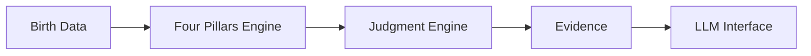

# UNMEI — Public Showcase Repository

> **AIは、人の未来をどこまで予測できるのか。**  
> 四柱推命の判断構造をアルゴリズムとして整理し、再現可能な判断とAIによる説明を分離して検証している個人開発プロジェクトです。


## このリポジトリについて

このリポジトリは、実開発中の **UNMEI** を面接・ポートフォリオ用途で説明するための **Public Showcase** です。

実際の開発リポジトリは Private で管理しており、以下は意図的に公開していません。

- 四柱推命 Judgment Engine の中核ルール
- Phase 1 / 2 / 3A / 3B の実装詳細
- 条件衝突の裁定ロジック
- 研究用 case corpus / 非公開メモ
- AI system prompt / AGENTS.md / CLAUDE.md
- API key / DB / payment / secrets
- 本番用の内部 contract 文書

この公開版では、**プロダクトの目的・アーキテクチャ・開発プロセス・検証方針・簡略化した代表コード**だけを確認できます。

---

## Project Question

### AIは、人の未来をどこまで予測できるのか。

未来を100%予測できると前提にしているわけではありません。

UNMEIでは、長い歴史の中で複数条件を組み合わせて人生の流れを解釈してきた四柱推命を、可能な範囲で構造化し、**どこまで一貫した判断が再現できるか / どこで限界が出るか**を実例・反例を通じて検証しています。

---

## Architecture



### 設計原則

**判断するのはシステム。伝えるのがAI。**

- 再現性が必要な計算・判断はコード側で管理
- LLMは検証済みの結果を説明する役割に限定
- 同じ入力から核心判断が揺れにくい構造を目指す
- モデルベンダーを変更しても判断ロジックは保持する

---

## Current Build Status

| Layer | Status |
|---|---|
| Phase 1 — Seasonal / Baseline | Done |
| Phase 2 — Structural Relations | Done |
| Phase 3A — Operational Path | Done |
| Phase 3B-1 — Claim / Dependency / SCC | Done |
| Phase 3B-2A — Outcome / Constraint Filtering | Done |
| Phase 3B-2B-1 — Final Joint Commit | Next |
| Strength / Following | Not started |
| Daewoon Integration | Later phase |

> 内部の命理ルールや裁定条件はこの公開版には含めていません。

### 実際のモジュール構成（公開可能範囲のみ）


---

## My Role

このプロジェクトはプログラミング未経験の状態から始めました。

AI Coding Toolsを利用していますが、AIにすべてを任せる方式ではなく、以下は自分で管理しています。

- 問題設定
- 調査対象と採用ルールの判断
- 優先順位
- 変更可能な範囲
- 完了条件
- テスト条件
- 結果の評価
- 次の仮説と実装順序

AIには主に、実装案・コード生成・リスク指摘・代替案・テスト作成・回帰影響の確認を担当させています。

詳しくは [`docs/development-process.md`](docs/development-process.md) を参照してください。

---

## Validation Approach

```text
仮説
↓
実例で検証
↓
不一致を確認
↓
原因を分析
↓
構造を修正
↓
別事例・反例で再検証
```

代表例:

- 月別の根拠が別の月へ混ざる問題 → provenance を導入
- UTC+8 / JST の節入り境界差 → timezone 責任を分離
- AIに事務的な整合作業まで任せた結果の失敗 → deterministic code へ戻す
- 個別関係だけで吉凶を決める傾向 → 全体構造優先へ変更

詳しくは [`docs/validation-strategy.md`](docs/validation-strategy.md)。

---

## Public Sample Code

`src/showcase/` のコードは **実際の命理ロジックを公開しないために簡略化したサンプル**です。

- Phase間の責任分離
- 前段階の結果を後段階が勝手に書き換えない設計
- unresolved 状態を明示する考え方
- 検証可能な出力 contract

実際の Judgment Engine のアルゴリズムを再現するものではありません。

---

## Tech Stack

- Next.js
- TypeScript
- Vitest
- lunar-typescript
- Mock AI Provider during current development
- Production AI Provider planned for later phase

## Notice

This repository is a portfolio showcase. Core judgment rules, arbitration logic, proprietary research, and production configuration are intentionally omitted.

Copyright © 2026. All rights reserved.
